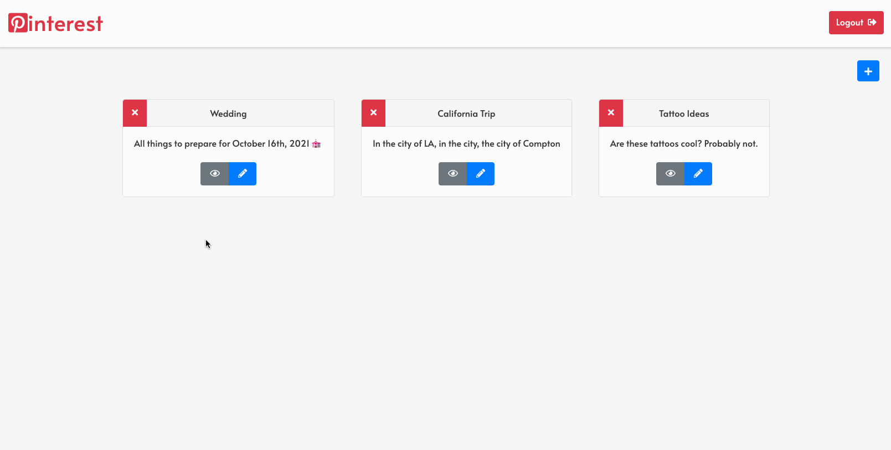

# React Pinterest

This was my first attempt using Firebase with React! This Web App consists of data in Firebase that will display depending on the user being authorized. You can select each board and the pins within that board will render.

The User can also add new boards/pins, delete them or update their data. A full CRUD web app!

## Preview

## Deployed Project
[react-pinterest-2c4ac.web.app](https://react-pinterest-2c4ac.web.app/)

## Clone the Repository
- Clone it 👉🏼 `$ git clone https://github.com/RyanBeiden/react-pinterest.git`

- Install the dependencies 👉🏼 `$ npm install`

- Run `$ npm start`

## Technologies Used
  
