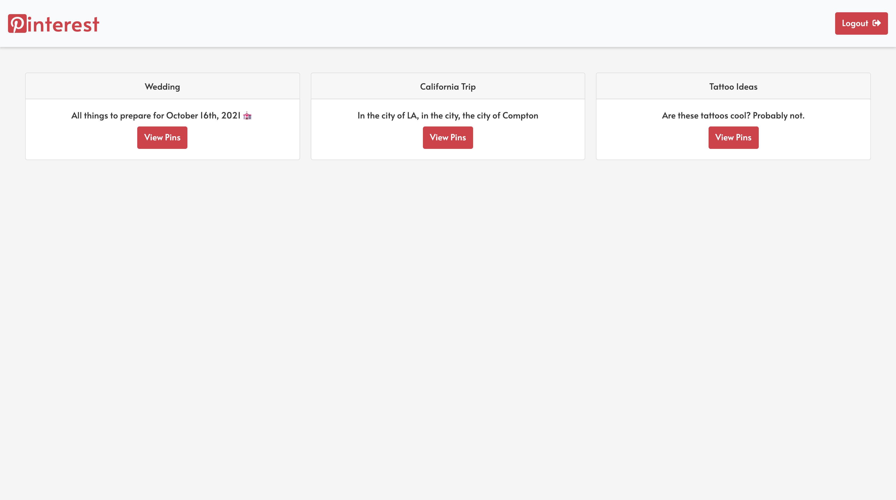

# React Pinterest

This was my first attempt uses Firebase with React! This Web App consists of data in Firebase that will display depending on the user being authorized and only displaying their boards. You can select each board and the pins withing just that board will render.

## Preview

## Clone the Repository
- Clone it 👉🏼 `$ git clone https://github.com/RyanBeiden/react-pinterest.git`

- Install the dependencies 👉🏼 `$ npm install`

- Run `$ npm start`

## Technologies Used
  
